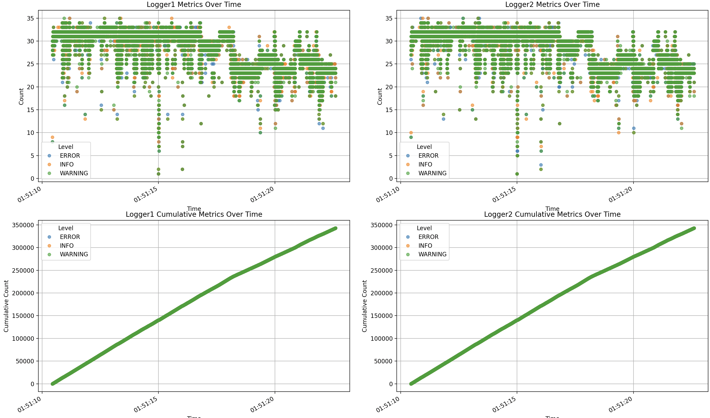

### notes on rich logging
`logging/rich_log_to_file.py` 

rich logging to a file sucks, dont use it 
rich logging should really just be used for terminal interfaces, and the python included  logging library is what should be used for most other cases. 
makes really pretty terminal logs though, so good for one off scripts. 

### Logging to multiple files 
`logging/multi_file_logger.py`
turns out there's a paragraph for this in the cookbook: https://docs.python.org/3/howto/logging-cookbook.html#logging-to-a-single-file-from-multiple-processes

### Python logging LEVELS
This is the list of logging levels in python, with the integer being the severity: 

    NOTSET=0
    DEBUG=10
    INFO=20
    WARN=30
    ERROR=40
    CRITICAL=50

### Log overflowing 
use `RotatingFileHandler`, ez pz. 

### Useful resources: 
https://docs.python.org/3/howto/logging-cookbook.html#

but based on experiments from logger1.py and logger2.py via ./multi_script.sh we can probably log to same file 

